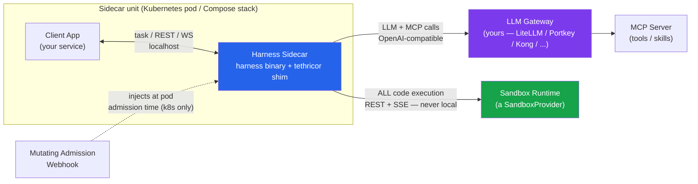
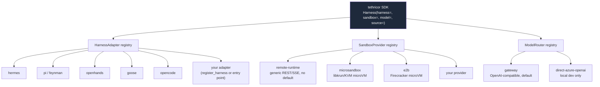
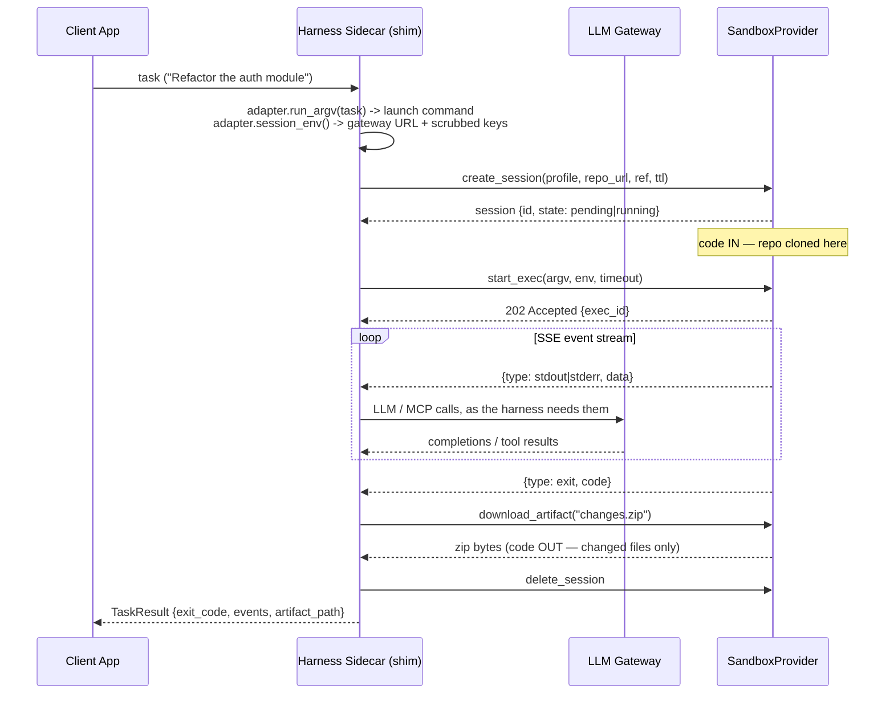
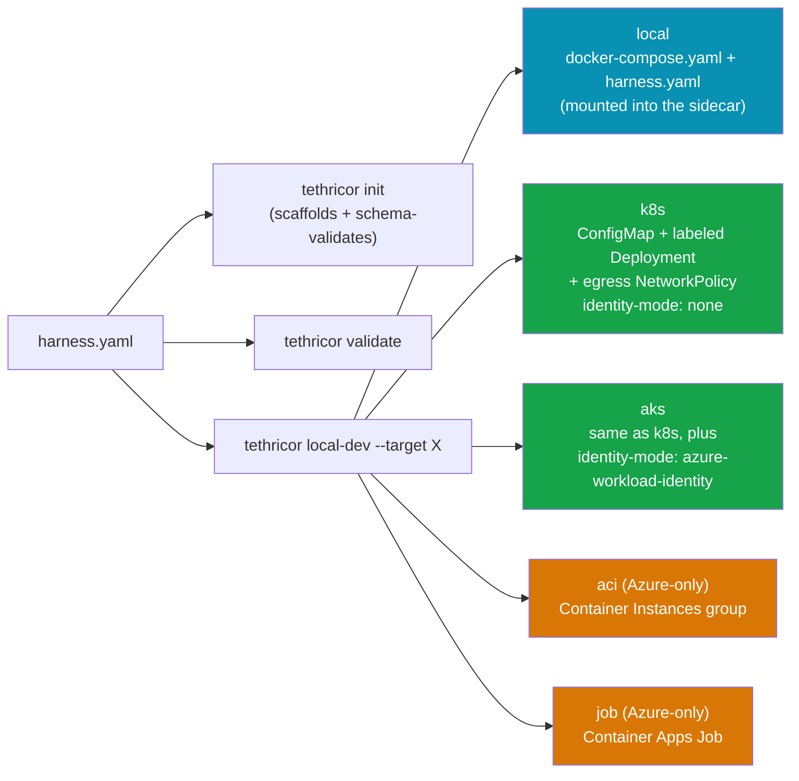
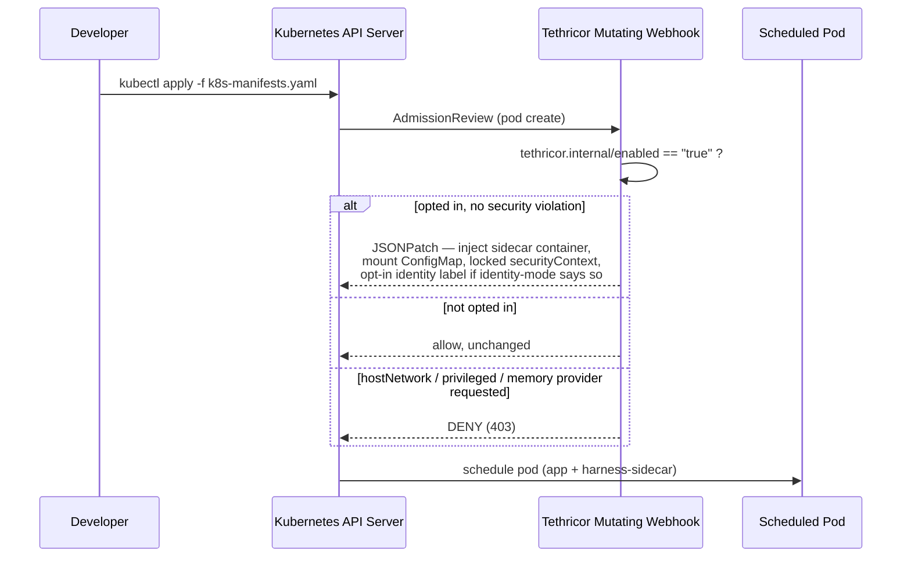
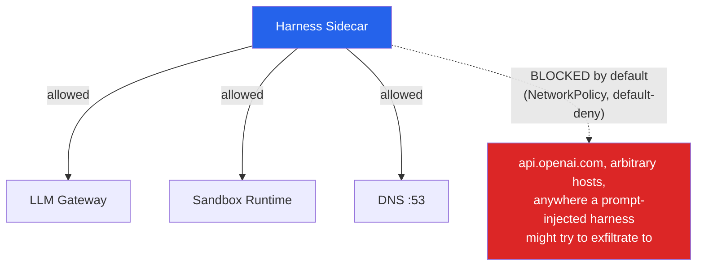
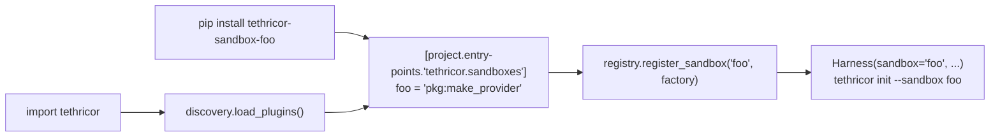

# Tethricor Framework Guide

A complete, diagram-driven explanation of how Tethricor works end to end: the
problem it solves, the three pluggable axes at its core, how a task actually flows
through the system, how it deploys to every target, and how the security model is
enforced at each layer. Read this after the [README](../README.md) quickstart if
you want the full picture rather than just "how do I run it."

## Table of contents

1. [The problem, in one sentence](#1-the-problem-in-one-sentence)
2. [Core concepts](#2-core-concepts)
3. [System architecture](#3-system-architecture)
4. [The three pluggable axes](#4-the-three-pluggable-axes)
5. [Task lifecycle, step by step](#5-task-lifecycle-step-by-step)
6. [The `harness.yaml` contract](#6-the-harnessyaml-contract)
7. [From config to deployment: the CLI](#7-from-config-to-deployment-the-cli)
8. [Deployment targets](#8-deployment-targets)
9. [The security model](#9-the-security-model)
10. [The SDK](#10-the-sdk)
11. [Extending Tethricor](#11-extending-tethricor)
12. [Testing & verification](#12-testing--verification)
13. [Known gaps & roadmap](#13-known-gaps--roadmap)
14. [Repository map](#14-repository-map)

---

## 1. The problem, in one sentence

Just as [LiteLLM](https://github.com/BerriAI/litellm) standardized the fractured
*model provider* landscape behind one interface, Tethricor standardizes the
*agent harness runtime* landscape — Hermes, Pi, OpenHands, Goose, opencode, or
one you write yourself — behind one interface, so a developer can attach any of
them to their application without rewriting application logic, and without the
harness ever getting direct, unmediated access to your LLM credentials or a
production host.

The mechanism is a **sidecar**: the harness runs in a container next to your
app, every LLM/MCP call is routed through your gateway, and every command the
harness wants to execute is forwarded to a sandbox instead of running in the
sidecar itself.

## 2. Core concepts

| Term | Meaning |
|---|---|
| **Harness** | The actual open-source agent loop (Hermes, Pi, OpenHands, Goose, opencode, or a custom one). Tethricor doesn't build these — it hardens and wraps them. |
| **Harness Adapter** | `HarnessAdapter` — maps a harness onto `{gateway, mcp, sandbox}`: how it takes a task, what env it needs, how its provider keys get scrubbed. |
| **Sandbox Provider** | `SandboxProvider` — the session/exec/stream/artifact contract any isolated execution backend implements. No default; you choose one. |
| **Model Router** | `ModelRouter` — resolves `model.routing_profile` to an OpenAI-compatible base URL (your gateway, or a local-only direct-Azure-OpenAI escape hatch). |
| **`harness.yaml`** | The one config file a developer writes. Validated against a JSON Schema; developer declares intent, the platform enforces security on top of it. |
| **Sidecar pattern** | The harness runs as a second container in the same pod/compose stack as your app, reachable over `localhost`. |
| **Code IN / Code OUT** | IN = the sandbox clones your repo at session start. OUT = a zip of changed files, downloaded via an artifact endpoint — never a git push, never raw stdout. |
| **Shim** | `tethricor_runtime`, installed inside every hardened harness image. It's the sole entrypoint; it forwards execution, never runs it. |

## 3. System architecture



Five moving parts, three of which are yours already:

- **Client App** — your service. Unmodified; it just calls `localhost` for tasks.
- **Harness Sidecar** — the one thing Tethricor actually ships: a hardened image
  (`docker/Dockerfile.*-hardened`) containing the harness binary plus the shim,
  which is the container's *only* entrypoint.
- **LLM Gateway / MCP Server** — yours. Tethricor assumes an OpenAI-compatible
  surface and never hardcodes a vendor.
- **Sandbox Runtime** — yours, or an adopted OSS pick (`microsandbox`, `e2b`), or
  the bundled local-dev mock. Whatever it is, it implements one contract
  (`api-spec/sandbox-execution-contract.yaml`).
- **Mutating Webhook** — only relevant for Kubernetes targets; injects the
  sidecar at admission time rather than the CLI doing it at generation time.

## 4. The three pluggable axes

This is the actual framework, not just the CLI/sidecar product on top of it. All
three are ABCs in `shim/tethricor_runtime/interfaces.py`, each with a registry
populated from Python entry points — LangChain's provider model, applied to
harnesses instead of models.



| Axis | ABC | Registry module | Entry-point group | Contract |
|---|---|---|---|---|
| Harness | `HarnessAdapter` | `tethricor_runtime/adapters.py` | `tethricor.harnesses` | `session_env()` (gateway routing + key scrub), `run_argv()` (task → launch command) |
| Sandbox | `SandboxProvider` | `tethricor_runtime/registry.py` | `tethricor.sandboxes` | `create_session → start_exec → stream_events → download_artifact → delete_session` |
| Model | `ModelRouter` | `tethricor_runtime/model.py` | `tethricor.models` | `llm_env()` → OpenAI-compatible base URL |

Discovery is automatic: `import tethricor` calls `discovery.load_plugins()` once,
which walks all three entry-point groups and populates the registries — a
third-party package like `tethricor-sandbox-microsandbox` needs zero core edits,
just a `[project.entry-points."tethricor.sandboxes"]` line in its own
`pyproject.toml`.

**Important scoping note:** a `HarnessAdapter` only covers *launch + hardening* —
turning a task into a command, scrubbing keys, setting gateway env. It does not
normalize the harness's own agent loop, tool-calling, or prompting, and it
doesn't provision the harness's own toolchain into whatever sandbox image the
command actually runs in. See [§13](#13-known-gaps--roadmap).

## 5. Task lifecycle, step by step

What actually happens between `h.run("do the thing")` and a `changes.zip` on
disk — every call in this diagram is real code you can trace (`orchestrator.py`
`run_task()` is the whole thing in ~60 lines):



The harness's own LLM/tool calls happen *during* the SSE loop, from inside the
sandbox session — they're not a separate phase. The one guarantee that never
breaks regardless of which harness or provider you've configured: **the shim
never runs `argv` itself.** Every command crosses the `SandboxProvider` boundary.

## 6. The `harness.yaml` contract

One file, JSON-Schema-validated (`schemas/harness-config-schema.json`,
`additionalProperties: false`). The organizing principle: **the developer
declares intent; the platform enforces security on top of it** — deployment
target, egress policy, pod security context, and workload identity are never
fields in this file; they're CLI flags or webhook-injected.

```yaml
apiVersion: tethricor.enterprise/v1
kind: HarnessConfig
harness:
  type: hermes            # open registry, not a closed enum
  version: "0.17.0"
model:
  routing_profile: gpt-4o-standard
  # direct_azure_openai:   # local-only escape hatch, stripped for non-local targets
skills: [code-review, jira]        # free-form v1, catalog-validated later
mcp:
  servers: [default-tools]         # same
runtime:
  profile: python312       # must exist on your sandbox backend
  timeout_seconds: 600
  provider: remote-runtime # required — no default sandbox provider
source:
  repo_url: https://github.com/your-org/app.git
  ref: main
output:
  mode: zip-download
```

| Section | Owner | Notes |
|---|---|---|
| `harness.type` / `version` | Developer | Registry-validated at generation/run time, not a static enum — see [§11](#11-extending-tethricor) |
| `model.routing_profile` | Developer | An alias your gateway resolves; never credentials |
| `runtime.provider` | Developer | **Required.** `remote-runtime`, `microsandbox`, `e2b`, or your own |
| `runtime.profile` | Developer | Must exist on whatever backend `runtime.provider` points at |
| `source.repo_url` / `ref` | Developer | Code IN |
| *(deployment target)* | **Not in this file** | `--target local\|k8s\|aks\|aci\|job` is a CLI flag — one config, several targets |
| *(security/identity/image)* | **Platform-injected** | Locked at generation time (CLI) or admission time (webhook); developer cannot set these |

## 7. From config to deployment: the CLI



Every target resolves the hardened image the same way: `harness.type` +
`harness.version` → `cli/tethricor_cli/data/image-manifest.yaml` → a pinned tag.
Developers cannot override the image itself — only `--image` can, and only as
an explicit escape hatch for a harness type with no manifest entry (e.g. a
custom-registered adapter).

## 8. Deployment targets

### Local (Docker Compose)

Generation-time injection — the CLI writes the whole compose file, including
the local mocks (`mock-gateway`, `mock-mcp`, `mock-sandbox`) so the bundle runs
fully offline. `harness.yaml` is written as a sibling file and bind-mounted
read-only into the sidecar at `/etc/tethricor/harness.yaml` — this is not
cosmetic; the shim's `Settings.from_env()` reads `runtime.provider`,
`source.repo_url`, and friends *exclusively* from that mounted file, never from
env vars, so the mount is load-bearing.

### Kubernetes (`k8s` / `aks`)

Admission-time injection — the CLI does *not* touch the pod spec directly. It
emits a ConfigMap + a labeled Deployment; a **mutating admission webhook**
(pure `AdmissionReview` logic, no cloud SDK dependency) does the actual
patching when the pod is created:



`k8s` and `aks` produce byte-identical output except for one annotation,
`tethricor.internal/identity-mode`: absent (→ no identity label, works on any
cluster) for `k8s`, `azure-workload-identity` for `aks`. Adding a second cloud's
identity mechanism is one more `elif` branch in the webhook, not a rewrite.

### `aci` / `job` (Azure-specific, opt-in)

No admission webhook exists for ACI or Container Apps Jobs, so the CLI composes
the sidecar directly into the generated resource at generation time. These stay
explicitly Azure-only — there's no fabricated AWS/GCP equivalent shipped here;
`k8s` is the cloud-neutral path if you're not on Azure.

| Target | Injection point | Cloud-neutral? |
|---|---|---|
| `local` | CLI (generation time) | Yes |
| `k8s` | Webhook (admission time) | Yes |
| `aks` | Webhook (admission time) | Yes, + Azure identity |
| `aci` | CLI (generation time) | No — Azure only |
| `job` | CLI (generation time) | No — Azure only |

## 9. The security model

Four invariants, enforced at different layers so no single bypass defeats them:



| Invariant | Enforced by | What breaks it if skipped |
|---|---|---|
| No local execution | Hardened image's `ENTRYPOINT` is the shim, full stop; every `SandboxProvider` call is REST/SSE | A harness running `bash` inside its own container instead of forwarding |
| Gateway-only LLM/MCP | `adapter.session_env()` blanks every known provider-key env var; `ModelRouter` sets the base URL | A leaked/inherited `OPENAI_API_KEY` reaching the harness process |
| Egress default-deny | Generated `NetworkPolicy` (k8s/aks) allows only `{gateway, sandbox runtime}` + DNS | An allow-all rule, or a missing NetworkPolicy entirely |
| Locked pod security | Webhook-injected `securityContext`: non-root, read-only rootfs, no privilege escalation, all caps dropped; developer cannot override | A hand-edited pod spec re-adding privileges after injection |
| `memory` provider refused | Webhook denies (403) any non-local target requesting the sandbox's in-process `memory` mode | Deploying with a non-isolated backend outside CI |
| Escape hatch contained | `model.direct_azure_openai` is schema-typed, CLI-stripped for every non-`local` target | The local-dev convenience leaking a real API key into a cluster |

## 10. The SDK

The CLI is a thin wrapper over the same orchestrator the SDK uses — there's one
code path, not two. `sandbox` is a required keyword argument; there is no
default sandbox provider anywhere in the framework.

```python
from tethricor import Harness

h = Harness(
    harness="hermes",
    model="gpt-4o-standard",
    sandbox="remote-runtime",             # required — no default
    source="https://github.com/org/repo.git",
)
result = h.run("Refactor the auth module and add tests")
print(result.ok, result.exit_code)
for event in result.events:               # typed stdout/stderr/exit
    ...
```

`Harness.run()` accepts either a natural-language task string (turned into the
adapter's conventional launch command) or an explicit `argv` list (forwarded
verbatim — the escape hatch for anything the launch convention doesn't cover,
or for harnesses without a real binary present, e.g. in tests). `Callbacks`
gives OTel/LangSmith-style lifecycle hooks (`on_session_start`, `on_exec_start`,
`on_event`, `on_artifact`, `on_session_end`) if you want tracing beyond the
typed `TaskResult`.

## 11. Extending Tethricor

Two ways to add a harness, in increasing order of permanence:

**In-process** (a script, a notebook, a test):
```python
from tethricor_runtime.adapters import register_harness
from tethricor_runtime.interfaces import HarnessAdapter

class MyAdapter(HarnessAdapter):
    name = "my-harness"
    default_profile = "python312"
    pre_artifact_argv = None
    def session_env(self, gateway_url, mcp_url):
        return {"MY_HARNESS_FLAG": "1"}

register_harness("my-harness", MyAdapter())
Harness(harness="my-harness", sandbox="remote-runtime", ...).run(...)
```
Works immediately, in that Python process only — a separate `tethricor` CLI
invocation (a different process) won't see it.

**As an installable package** (the real, persistent path — this is exactly how
`providers/tethricor-sandbox-microsandbox` registers itself):

Any `SandboxProvider` you write must pass the shared conformance kit
(`tethricor_runtime.testing.assert_sandbox_conformance`) — it's the same test
both OSS providers are gated on, exercised against hermetic in-package fakes so
CI needs no KVM or API keys.

## 12. Testing & verification

Three layers, cheapest to most realistic — full walkthrough in
[`docs/TESTING.md`](TESTING.md):

1. **`pytest`** (no containers) — schema/CLI, mock sandbox contract, webhook
   admission logic, shim clone→exec→zip→delete, cross-cutting security
   invariants. 84 tests, a few seconds.
2. **`docker-compose.test.yaml`** — a complete offline stack built from source
   (mocks + a test-only shim image), proving real code-IN/code-OUT with actual
   containers.
3. **A real harness image** — swap the compose stack's `harness` service for
   one of `docker/Dockerfile.*-hardened` to exercise an actual harness binary.

## 13. Known gaps & roadmap

Documented rather than silently glossed over:

- **Sandbox-profile provisioning.** A `HarnessAdapter.run_argv()` produces a
  command like `["hermes", "run", "--task", "..."]`; that command executes
  inside whatever `runtime.profile` sandbox session is running — not the
  sidecar container. Nothing here automatically installs a harness's own
  toolchain into that sandbox image. Fixing this means extending
  `SandboxProvider.create_session` with an optional per-session image
  override, across every provider and the conformance kit — real new
  interface surface, deliberately not built speculatively.
- **Adapter launch conventions are unverified** against real published harness
  packages — `entrypoint`/`task_arg` per adapter are documented as
  "conventional, pin against the real CLI before production."
- **Typed live skills/MCP catalog resolution** — `skills`/`mcp.servers` stay
  free-form strings in v1 by design (`DESIGN_NOTES.md` A1); a `CatalogResolver`
  interface is the natural next step.
- **TypeScript SDK** — mirrors the Python `Harness` facade; sequenced after
  Python SDK adoption, shares the OpenAPI contract in `api-spec/`.

## 14. Repository map

| Path | What it is |
|---|---|
| `schemas/harness-config-schema.json` | The `harness.yaml` contract |
| `api-spec/sandbox-execution-contract.yaml` | What every `SandboxProvider` implements |
| `cli/` | The `tethricor` CLI + per-target generators (`generators/k8s.py`, `aks.py`, `compose.py`, `azure/{aci,job}.py`) |
| `shim/tethricor_runtime/` | The execution shim: `interfaces.py` (the three ABCs), `adapters.py`, `registry.py`, `model.py`, `orchestrator.py`, `testing.py` (conformance kit) |
| `shim/tethricor/` | The public SDK facade: `Harness`, typed `Event`/`TaskResult`/`SandboxSession` |
| `providers/` | Adopted OSS `SandboxProvider` packages (`microsandbox`, `e2b`) |
| `webhook/` | The Kubernetes mutating admission webhook |
| `docker/` | Hardened per-harness Dockerfiles |
| `local-dev/` | Local parity doubles (`mock_sandbox.py`, `mock_gateway.py`, `mock_mcp.py`) |
| `tests/test_e2e_security.py` | Cross-cutting security + E2E invariants |
| `docs/agent_context/` | This project's build history and design decisions |

---

Questions this guide doesn't answer belong in an issue, not a guess — the
`docs/agent_context/` decision log is the place to check whether something was
already decided (and why) before relitigating it.
